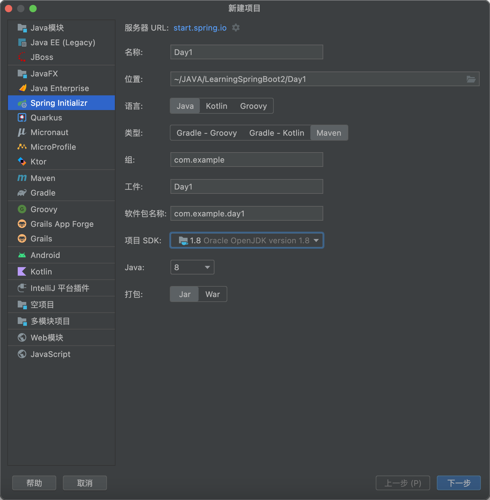

# 笔记

## 相关配置



注意三个目录：

```
src/main/java: 程序开发以及主程序目录
src/main/resources: 配置文件和资源文件目录
src/test/java: 测试程序目录
```

## pom.xml

项目相关的依赖信息等

## 第一个helloworld程序

`Controller`VS`RestController`

修改端口：`server.port=6666`

## 单元测试

### 测试函数

```java
@SpringBootTest
public class HelloTest {
    @Test
    public void hello(){
        System.out.println("Hello Spring Boot Test");
    }
}
```

### 测试Controller

```java
@RunWith(SpringRunner.class)
@WebMvcTest(HelloController.class)
public class HelloControllerTest {

    @Autowired
    private MockMvc mockMvc;

    @Test
    public void hello() throws Exception{
        mockMvc.perform(MockMvcRequestBuilders.post("/hello")
                .contentType(MediaType.APPLICATION_JSON))
                .andExpect(status().isOk())
                .andDo(print());
    }
}
```

注意JUnit版本！

## 开发环境热部署

### 添加依赖

```xml
        <dependency>
            <groupId>org.springframework.boot</groupId>
            <artifactId>spring-boot-devtools</artifactId>
            <optional>true</optional>
        </dependency>
```

### 配置devtools

```properties
spring.devtools.restart.enabled=true

spring.devtools.restart.additional-paths=src/main/java

spring.devtools.restart.exclude=WEB-INF/**

spring.thymeleaf.cache=false
```

### 实验

测试了一下，发现本地修改了Controller之后，Spring确实会重新编译一遍，但是刷新了以后还是原来的内容

不知道为什么